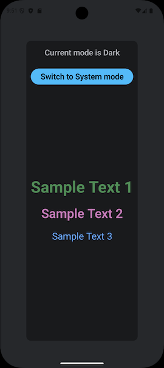
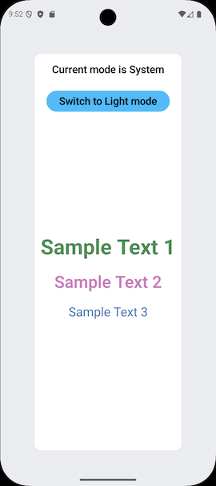

# Android Custom Theme

A focused, production-quality example of building a custom theme system for Jetpack Compose that is a complete, standalone replacement for `MaterialTheme` — not an extension of it, not a wrapper around it, and not dependent on it in any way.

`MaterialTheme` is a design system. This project demonstrates how to build your own theming layer from first principles using the same Compose primitives that `MaterialTheme` itself is built on: `CompositionLocal`, stability annotations, and `remember`-keyed caching. The result is a theme you own entirely, with no Material design constraints, no Material color roles, and no Material typography scale unless you choose to add them.

The demo app is intentionally minimal. It omits ViewModels, Repositories, navigation, and dependency injection not because production apps don't need them, but because they are orthogonal to what is being demonstrated. The theme system has no opinion about how the rest of your application is structured, and integrates cleanly alongside any architecture you choose.

A companion article walks through the design decisions in detail. *(link forthcoming)*

---

## Screenshots

<table>
  <tr>
    <td align="center">
      <br/>
      <b>Dark mode</b>
    </td>
    <td align="center">
      <br/>
      <b>System mode</b> (OS set to light)
    </td>
  </tr>
</table>

The second screenshot shows *System* mode, not Light mode selected manually. When the OS is in light mode, System resolves to the light color scheme automatically — and switches to dark if the user changes the system setting at runtime, without any action required from the app.

---

## What this demonstrates

Most theming tutorials stop at swapping a few color values. This project shows the complete picture:

- A `CompositionLocal`-based theme that distributes colors, metrics, and typography through the composition tree without passing parameters everywhere
- Three-mode theme switching (System / Light / Dark) with a single `MutableState` — no `ViewModel`, no state management library required
- Reactive system dark-mode detection using Compose's `isSystemInDarkTheme()`, so the UI recomposes automatically when the user changes the system setting at runtime
- `@Immutable` and `@Stable` annotations applied correctly so the Compose compiler can skip unnecessary recompositions
- `remember(key)` used to cache color objects so new instances aren't allocated on every recomposition
- Singleton `object` declarations for stateless theme components (metrics and typography) that have no reason to be instantiated more than once
- Color utility extensions (`darken`, `lighten`) with consistent parameter semantics and correct alpha preservation
- Unit and instrumented tests, including tests that account for Compose's color-space-aware `lerp` behavior

---

## Project structure

```
theme/
  CustomTheme.kt          # CompositionLocals, CurrentTheme enum, CustomTheme composable and accessor object
  CustomThemeColors.kt    # @Immutable color interface + Dark and Light implementations
  CustomThemeMetrics.kt   # @Stable singleton — spacing and corner radii
  CustomTypeStyles.kt     # @Stable singleton — text styles

utils/
  SystemMode.kt           # isSystemInDarkMode() — @Composable, reactive
  extensions.kt           # Color.darken() / Color.lighten()

App.kt                    # Demo composable — shows the theme in use
MainActivity.kt           # Entry point; sets up edge-to-edge and wraps App in CustomTheme

test/
  ThemeUnitTests.kt       # JVM unit tests: CurrentTheme.next() cycling, color extension math
androidTest/
  ThemeInstrumentedTest.kt  # Compose UI test: verifies CustomTheme initialises to System mode
```

---

## How the theme system works

### Distribution

`CustomTheme` is a composable wrapper. Wrap your content in it once at the top of the tree:

```kotlin
CustomTheme {
    App()
}
```

Anywhere inside that tree, access theme values through the `CustomTheme` object:

```kotlin
Text(
    text = "Hello",
    color = CustomTheme.colorScheme.textOne,
    style = CustomTheme.typeScheme.bodyLarge,
)
```

No prop-drilling. No ambient singletons. The values flow through `CompositionLocal` — the standard Compose mechanism for implicit tree-scoped data.

### Theme switching

The current theme mode is held in a `MutableState<CurrentTheme>` exposed via `CustomTheme.themeMode`. Changing it is one line:

```kotlin
val mode = CustomTheme.themeMode
Button(onClick = { mode.value = mode.value.next() }) { ... }
```

`next()` cycles through `System → Light → Dark → System`. No `when` blocks at the call site — the enum owns its own transition logic.

### System dark mode

`CurrentTheme.System` defers to the OS setting at runtime. The detection uses Compose's `isSystemInDarkTheme()`, which reads from `LocalConfiguration.current`. Because it's a composition local, Compose automatically recomposes affected subtrees when the system theme changes — no broadcast receivers, no lifecycle observers.

### Adding a new color

1. Add a property to the `CustomThemeColors` interface.
2. Implement it in both `CustomThemeColorsDark` and `CustomThemeColorsLight`.
3. Access it anywhere via `CustomTheme.colorScheme.yourProperty`.

The compiler enforces that both implementations stay in sync.

### Adding new metrics or type styles

Add a property to the `CustomThemeMetrics` or `CustomTypeStyles` object. Because these are singletons with no light/dark variants, there is nothing else to update.

---

## Extending to more than two color schemes

The `when` block in `CustomTheme.kt` is the only place that maps a `CurrentTheme` value to a color implementation. Adding a high-contrast scheme, for example, means:

1. Adding `HighContrast` to the `CurrentTheme` enum
2. Creating a `CustomThemeColorsHighContrast` class
3. Adding one branch to the `when` block

Everything else — the `CompositionLocal` distribution, the state management, the `next()` cycling — adapts automatically.

---

## Running the tests

**Unit tests** (no device required):
```bash
./gradlew test
```

**Instrumented tests** (requires a connected device or emulator):
```bash
./gradlew connectedAndroidTest
```

The unit tests cover `CurrentTheme.next()` cycling and the `darken`/`lighten` extension math. One subtlety worth noting: Compose's `lerp(Color, Color, Float)` converts to a linear light color space before interpolating and converts back afterward, so midpoint channel values do not follow simple SRGB fractions. The tests account for this by asserting direction (darker/lighter than the original) rather than exact channel values, and use a tolerance of `0.002f` for boundary assertions to accommodate 8-bit channel quantization (maximum error: `0.5 / 255 ≈ 0.00196`).

---

## Tech stack

| | |
|---|---|
| Language | Kotlin 2.2.10 |
| UI framework | Jetpack Compose (BOM 2026.02.01) |
| Android Gradle Plugin | 9.1.1 |
| Min SDK | 26 (Android 8.0) |
| Target SDK | 36 |

---

## About

Roy Watson is a freelance software developer with decades of experience and a focus on Android development since 2009. This project is part of a series of public examples demonstrating current Android architecture and Compose patterns.

[roywatson.app](https://roywatson.app)
